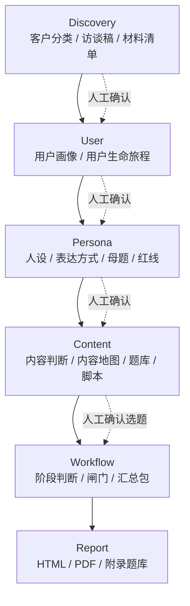

# RTA Skill

一个统一的 RTA 总入口 skill。

它不是单点功能，而是一条连贯链路：

`Discovery -> User -> Persona -> Content -> Workflow -> Report`

适合两种使用方式：

1. 你自己拿客户访谈资料来跑
2. 客户自己安装后，让自己的 Agent 按步骤访谈和分析

## 这套 skill 为什么这样设计

因为 RTA 不是“先想定位，再写内容”。

它的顺序是固定的：

1. **先做 Discovery**  
   先判断客户是零基础、已验证还是混合型，同时补三类画像和母题种子。

2. **再做 User**  
   把用户画像和用户生命旅程拉出来，确认谁值得打、谁接近成交、谁应该排除。

3. **再做 Persona**  
   把“这个人该怎么说”定下来，不然内容会散。

4. **再做 Content**  
   内容不是凭空想出来的，它必须绑定画像、阶段、母题和表达边界。

5. **Workflow 做总控**  
   负责判断：现在能不能进入下一步，还缺什么，哪里必须人工确认。

6. **最后做 Report**  
   报告是交付层，不是分析层。它应该承接前面已经成立的判断。

## 整体链路图



## 目录结构

```text
rockf-rta-skill/
├── SKILL.md
├── README.md
├── agents/
├── references/
│   ├── discovery/
│   ├── user/
│   ├── persona/
│   ├── content/
│   ├── workflow/
│   ├── report/
│   ├── usage-guide.md
│   └── workflow-why.md
├── templates/
│   ├── discovery/
│   ├── user/
│   ├── persona/
│   ├── content/
│   ├── workflow/
│   └── report/
└── scripts/
```

## 使用顺序

### 方式 A：从零开始

适合新客户、资料不完整的客户：

`Discovery -> User -> Persona -> Content -> Workflow -> Report`

### 方式 B：已有上游材料

如果你已经有：
- 逐字稿
- 用户画像
- 用户生命旅程

可以从对应阶段接入，但仍建议先让 Workflow 判断。

## 推荐起手 prompt

```text
请使用 RTA skill。
先判断我现在处于哪一个阶段。
如果还没完成前置访谈，请先走 Discovery。
如果已经有上游资料，请告诉我缺什么、下一步该做什么，并保留人工确认闸门。
```

## 仓库内不包含什么

这个仓库是对外发布版，不包含：

- 客户逐字稿
- 客户报告
- 客户题库
- 客户测试样例
- 任何真实业务数据

只保留：

- 规则
- 模板
- schema
- 脚本
- 使用说明
